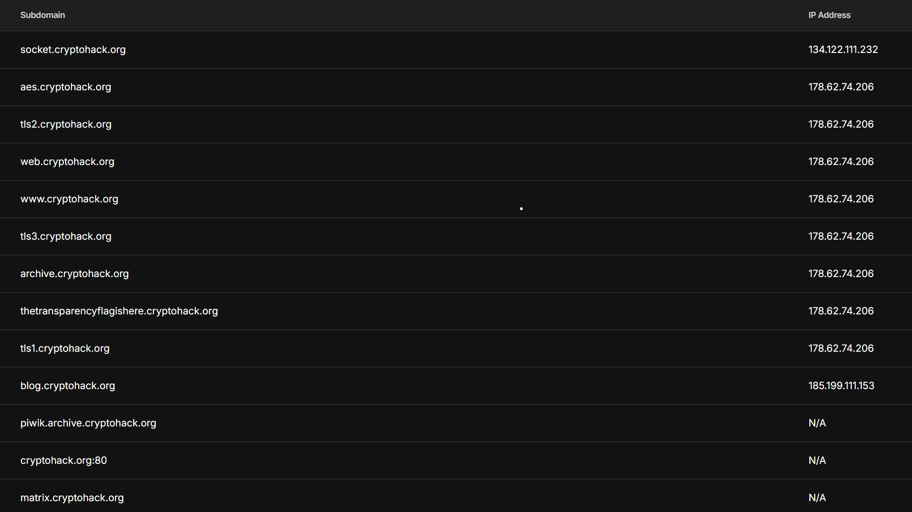
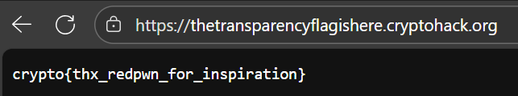

## Transparency - Writeup (CryptoHack)

### Mô tả tổng quan

Một public key RSA (file `transparency.pem`) được cung cấp. Tìm subdomain của `cryptohack.org` mà TLS certificate của nó dùng đúng public key đó, rồi truy cập subdomain để lấy flag.

### Cách giải

1. Sử dụng https://pentest-tools.com/information-gathering/find-subdomains-of-domain - Một dịch vụ trực tuyến để tìm subdomain của một domain.
2. Nhập `cryptohack.org` vào thanh tìm kiếm, kết quả trả về nhiều subdomain.
   
3. Truy cập từng subdomain để kiểm tra.
4. Flag xuất hiện tại subdomain `thetransparencyflagishere.cryptohack.org`
    

### Flag
`crypto{thx_redpwn_for_inspiration}`